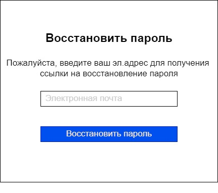

# 1. ОПИСАНИЕ ПОЛЬЗОВАТЕЛЬСКИХ ИНТЕРФЕЙСОВ

## 1.1.	Экранные формы Приложения для опекуна

| № п/п | Наименование элемента | Тип элемента | Назначение элемента | Описание, комментарии, ограничения |
|----|----|----|----|----|
| 1 | *Вход в личный кабинет* | *Шапка окна* | *Отображает название страницы приложения* |  |
| 2 | *Войти через Госуслуги (ЕСИА)* | *Кнопка* | *По нажатию происходит переход на страницу Госуслуг с возможностью авторизоваться* |  |
| 3 | *Зарегистрироваться* | *Гиперссылка* | *По нажатию позволяет зарегистрироваться на Госуслугах* | *При переходе по гиперссылке пользователь попадает на страницу регистрации нового пользователя Госуслуг* |

| № п/п | Наименование элемента | Тип элемента | Назначение элемента | Описание, комментарии, ограничения |
|----|----|----|----|----|
| 1 | *Личный кабинет опекуна* | *Шапка окна* | *Отображает название страницы приложения* |  |
| 2 | *Создать отчет* | *Кнопка* | *По нажатию происходит переход на страницу создания отчета* |  |
| 3 | *Загрузить документ* | *Кнопка* | *По нажатию происходит переход на страницу загрузки документов* |  |
| 4 | *Главная* | *Иконка/Кнопка* | *По нажатию происходит переход на главную страницу личного кабинета (в данном случае текущая)* | *Данная кнопка находится на панели меню, которое присутствует и на других страницах приложения* |
| 5 | *Отчеты* | *Иконка/Кнопка* | *По нажатию происходит переход на страницу для создания нового отчета пользователя* | *Данная кнопка находится на панели меню, которое присутствует и на других страницах приложения* |
| 6 | *Документы* | *Иконка/Кнопка* | *По нажатию происходит переход на страницу создания документов пользователем* | *Данная кнопка находится на панели меню, которое присутствует и на других страницах приложения* |
| 7 | *Уведомления* | *Иконка/Кнопка* | *По нажатию происходит переход на страницу уведомлений* | *При появлении новых уведомлений на данной иконке возникает цифра, сигнализирующая о количестве новых уведомлений. Данная кнопка находится на панели меню, которое присутствует и на других страницах приложения* |
| 8 | *Профиль* | *Иконка/Кнопка* | *По нажатию происходит переход на страницу с личными данными опекуна и подопечного* | *Данная кнопка находится на панели меню, которое присутствует и на других страницах приложения* |

| № п/п | Наименование элемента | Тип элемента | Назначение элемента | Описание, комментарии, ограничения |
|----|----|----|----|----|
| 1 | *Создать отчет* | *Шапка окна* | *Отображает название текущей страницы приложения* | |
| 2 | *Стрелка* | *Кнопка* | *Позволяет перейти/вернуться на главную страницу* | |
| 3 | *Text* | *Строка* | *Строка для заполнения пользователем* | *Строка, подсвеченная серым, является неактивной и заполняется автоматически (Данные подгружаются из кабинета Госуслуг). Неподсвеченные строки пользователь должен заполнить самостоятельно* |
| 4 | *Сохранить* | *Кнопка* | *По нажатию происходит сохранение данных, введенных в строках на текущей странице* | *Данные сохраняются в виде новой строки на странице "Отчеты"* |
| 5 | *Полоса прокрутки* | *Полоса прокрутки* | *Позволяет перемещать окно просмотра, и одновременно является индикатором его положения* | |

| № п/п | Наименование элемента | Тип элемента | Назначение элемента | Описание, комментарии, ограничения |
|----|----|----|----|----|
| 1 | *Загрузить документ* | *Шапка окна* | *Отображает название страницы приложения* |  |
| 2 | *Стрелка* | *Кнопка* | *Позволяет перейти/вернуться на главную страницу* | |
| 3 | *Номер отчета* | *Кнопка* | *По нажатию появляется возможность выбрать нужный отчет из выпадающего списка* | *В выпадающий список попадают только те отчеты, которые были загружены пользователем ранее* |
| 4 | *Статья расходов* | *Строка* | *Строка для заполнения пользователем* | *Позволяет пользователю ввести название статьи расходов* |
| 5 | *Сумма расхода* | *Строка* | *Строка для заполнения пользователем* | *Позволяет пользователю ввести сумму по указанной статье расходов* |
| 6 | *Добавить скан* | *Кнопка* | *Возможность добавления документа с устройства* | *Поддерживаемые форматы: docx, pdf, jpg, png* |
| 7 | *Qr-код* | *Кнопка* | *Позволяет перейти в режим съемки камеры для считывания Qr-кода с платежного документа* |  |
| 8 | *Сохранить* | *Кнопка* | *По нажатию происходит сохранение данных, внесенных на текущей странице*  | *Данные сохраняются в виде новой строки на странице "Документы"* |

| № п/п | Наименование элемента | Тип элемента | Назначение элемента | Описание, комментарии, ограничения |
|----|----|----|----|----|
| 1 | *Отчеты* | *Шапка окна* | *Отображает название страницы приложения* |  |
| 2 | *Год* | *Кнопка* | *По нажатию появляется возможность выбрать интересующий год из выпадающего списка* | *В выпадающий список попадают только те годы, по которым загружены отчеты ранее* |
| 3 | *Просмотр* | *Кнопка* | *При нажатии происходит открытие выбранного отчета* |  |
| 4 | *Изменить* | *Кнопка* | *По нажатию происходит открытие выбранного отчета с возможностью его корректировки* |  |
| 5 | *Номер* | *Название столбца* | *Присвоенный порядковый номер отчета* |  |
| 4 | *Создан* | *Название столбца* | *Дата создания документа* |  |
| 4 | *Изменен* | *Название столбца* | *Дата изменения документа* |  |
| 4 | *Статус* | *Название столбца* | *Статус документа присваивается в зависимости от этапа. Статус отправленным документам выставляет инспектор органов опеки* |  |
| 4 | *Строки* | *Строки с информацией* | *По нажатию происходит выбор документа* | *Выбор документа происходит при нажатии на любое место нужной строки, не зависимо от столбца* |
| 4 | *Подписать* | *Кнопка* | *По нажатию появляется возможность выбрать загруженную ЭЦП и произвести подписание отчета* |  |
| 4 | *Отправить* | *Кнопка* | *По нажатию происходит отправка  выбранного отчета в органы опеки* |  |
| 5 | *Полоса прокрутки* | *Полоса прокрутки* | *Позволяет перемещать окно просмотра, и одновременно является индикатором его положения* | |

| № п/п | Наименование элемента | Тип элемента | Назначение элемента | Описание, комментарии, ограничения |
|----|----|----|----|----|
| 1 | *Документы* | *Отображает название страницы приложения* | | |
| 2 | *Номер года* | *Кнопка* | *По нажатию появляется возможность выбрать интересующий год из выпадающего списка* | *В выпадающий список попадают только те годы, по которым документы загружены ранее* |
| 3 | *Столбец 1* | *Наименование статьи расхода* |  |  |
| 4 | *Столбец 2* | *Сумма расхода по статье* | |  |
| 5 | *Просмотр* | *Кнопка* | *При нажатии происходит открытие документа, прикрепленного к выбранной статье* |  |
| 6 | *Корзина* | *Кнопка* |*При нажатии происходит удаление выбранной строки, в том числе и прикрепленный документ* | |

| № п/п | Наименование элемента | Тип элемента | Назначение элемента | Описание, комментарии, ограничения |
|----|----|----|----|----|
| 1 | *Уведомления* | *Шапка окна* | *Отображает название страницы приложения* |  |
| 2 | *Новые* | *Кнопка* | *Позволяет отсортировать поступившие уведомления и оставить на экране только непрочитанные* |  |
| 3 | *Прочитанные* | *Кнопка* | *При нажатии на экране появятся все прочитанные ранее уведомления* |  |
| 4 | *Heading* | *Метка* | *Отображает заголовок сообщения* |  |
| 5 | *09:00* | *Метка* | *Отображает время поступления уведомления* |  |
| 6 | *Текст сообщения* | *Текст* | *Отображает содержание уведомления* |  |

| № п/п | Наименование элемента | Тип элемента | Назначение элемента | Описание, комментарии, ограничения |
|----|----|----|----|----|
| 1 | *Профиль* | *Шапка окна* | *Отображает название страницы приложения* |  |
| 2 | *Мои ЭЦП* | *Вкладка* | *При нажатии появляется просмотреть доступные ЭЦП* |  |
| 3 | *Личные данные* | *Вкладка* | *При нажатии происходит открытие страницы с личными данными опекуна* | *Данные подтягиваются из Госуслуг автоматически* |
| 4 | *Личные данные подопечного* | *Вкладка* | *При нажатии происходит открытие страницы с личными данными опекаемого* | *Данные подтягиваются из Госуслуг автоматически* |
| 4 | *Адреса* | *Вкладка* | *При нажатии происходит открытие страницы с адресами опекуна и опекаемого* |  |
| 5 | *Недвижимость и имущество* | *Вкладка* | *При нажатии происходит открытие страницы со всей необходимой (для формирования отчета) информацией об имуществе, принадлежащем опекаемому* | *Данные подтягиваются из Госуслуг автоматически* |
| 6 | *Личные данные опекуна* | *Шапка окна*| *Отображает название страницы приложения* | |
| 7 | *Текст* |   *Строка* |  *Отображает Личные данные опекуна*| *Данные подтягиваются их Госуслуг атоматически. До нажатия кнопки "Редактировать" элемент не активен* |
| 8 | *Редактировать* | *Кнопка* | *При нажатии элемент строка становится доступным для редактирования* | |
| 9 | *Сохранить* | *Кнопка* | *При нажатии применяется изменения* | *Измененные данные автоматически поддягиваются в отчет*|
| 10 | *Отмена* | *Кнопка* | *При нажатии внесенные изменения не применяются*| |

## 1.2.	Экранная форма Вход в программу сотрудника органов опеки

 

