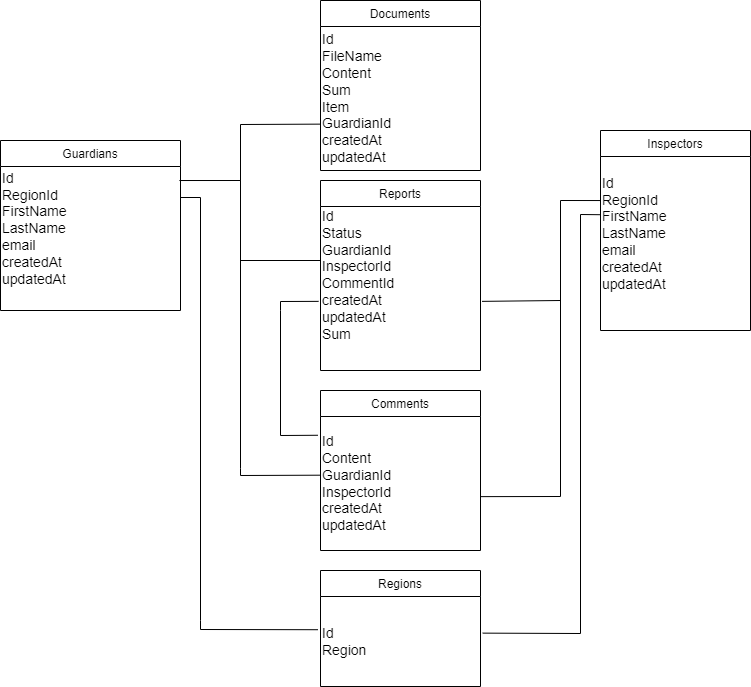

# REST API


## Клиенты REST API


Клиенты REST API:
- Мобильное приложение
- Web-интерфейс администратора


## Роли


- Зарегистрированный пользователь;
- Администратор.

## Запросы и ответы

ER-диаграмма представлена на рис.9

  

Рисунок 9
 
 При работе МП опекуна и веб-страницы сотрудника органов опеки используются REST-API:

### Веб-страница сотрудника органов опеки:
 1. ### Получение списка отчетов
`Get/Reports`  
Пример Ответа:

```json

[
    {
        "id": "f10716c6-16bf-44d4-979f-7cb9b7c1f13b",
        "Status": "Утверждено",
        "GuardianId": "89a13bb2-ab00-4e96-8da6-8d275024afa1",
        "InspectorId": "db516894-eb5b-41a2-9c85-a17fcdd5407e",
        "CommentId": [
            "db516894-eb5b-41a2-9c85-a17fcdd5407e",
            "f10716c6-16bf-44d4-979f-7cb9b7c1f13b"
        ],
        "createdAt": "2021-07-05T01:20:31Z",
        "updatedAt": "2021-07-06T01:20:31Z",
        "Sum": "15000"
    },
    {
        "id": "f10716c6-16bf-44d4-979f-7cb9b7c1f13b",
        "Status": "На проверке",
        "GuardianId": "89a13bb2-ab00-4e96-8da6-8d275024afa1",
        "InspectorId": "db516894-eb5b-41a2-9c85-a17fcdd5407e",
        "CommentId": [
            "db516894-eb5b-41a2-9c85-a17fcdd5407e",
            "f10716c6-16bf-44d4-979f-7cb9b7c1f13b"
        ],
        "createdAt": "2021-07-05T01:20:31Z",
        "updatedAt": "2021-07-06T01:20:31Z",
        "Sum": "15000"
    }
]
```
 2. ### Получение  отчета по id 
`Get/Reports/reportId`  
Пример Ответа:

```json
{
        "Status": "На проверке",
        "GuardianId": "89a13bb2-ab00-4e96-8da6-8d275024afa1",
        "InspectorId": "db516894-eb5b-41a2-9c85-a17fcdd5407e",
        "CommentId": [
            "db516894-eb5b-41a2-9c85-a17fcdd5407e",
            "f10716c6-16bf-44d4-979f-7cb9b7c1f13b"
        ],
        "createdAt": "2021-07-05T01:20:31Z",
        "updatedAt": "2021-07-06T01:20:31Z",
        "Sum": "15000"
    }
```

  

3. ### Получение отчетов по региону
`Get/reports?q region_id`

Пример Ответа:
```json
[
    {
        "id": "f10716c6-16bf-44d4-979f-7cb9b7c1f13b",
        "Status": "Утверждено",
        "GuardianId": "89a13bb2-ab00-4e96-8da6-8d275024afa1",
        "InspectorId": "db516894-eb5b-41a2-9c85-a17fcdd5407e",
        "CommentId": [
            "db516894-eb5b-41a2-9c85-a17fcdd5407e",
            "f10716c6-16bf-44d4-979f-7cb9b7c1f13b"
        ],
        "createdAt": "2021-07-05T01:20:31Z",
        "updatedAt": "2021-07-06T01:20:31Z",
        "Sum": "15000"
    },
    {
        "id": "f10716c6-16bf-44d4-979f-7cb9b7c1f13b",
        "Status": "На проверке",
        "GuardianId": "89a13bb2-ab00-4e96-8da6-8d275024afa1",
        "InspectorId": "db516894-eb5b-41a2-9c85-a17fcdd5407e",
        "CommentId": [
            "db516894-eb5b-41a2-9c85-a17fcdd5407e",
            "f10716c6-16bf-44d4-979f-7cb9b7c1f13b"
        ],
        "createdAt": "2021-07-05T01:20:31Z",
        "updatedAt": "2021-07-06T01:20:31Z",
        "Sum": "15000"
    }
]

```


4. ### Создание комментария к отчету
  `Post/reports/:reports_id/comments` 

  Пример Запроса:
```json

{
  "Comment": "string"
}
```

Пример Ответа:
```json
  {
  "id": "da787608-1d7e-4cb2-bc0c-51392eadc52a"
}
```


5. ### Изменение статуса отчета
`Patch/repurts/id`
 Пример Запроса:

```json
{
  "status": "Принят"
}
```

Пример Ответа:
```json
{
  "id": "da787608-1d7e-4cb2-bc0c-51392eadc52a",
  "InspectorId": "da787608-1d7e-4cb2-bc0c-51392eadc72a",
  "CommentId": : "da787608-1d7e-4cb2-bc0c-51392eadc52a",
  "Sum": "145752": "",
  "createdAt": "2021-05-20T12:00:00Z",
  "updatedAt": "2021-05-20T14:15:00Z"
}
```


6. ### Удаление комментария

`Delete/reports/comments/id`

Пример запроса
```json
  Delete/reports/commentsda787608-1d7e-4cb2-bc0c-51392eadc52a
```

7. ### Изменение комментария
`Patch/comments/id`

Пример запроса 
```json
{
  "Content": "Приложны верные документы"
}
```
Пример ответа
```json

{
  "id": "da787608-1d7e-4cb2-bc0c-51392eadc52a",
  "Content": "Приложны верные документы"
  "GuardianId": "da787608-1d7e-4cb2-bc0c-51392eadc72a",
  "CommentId": : "da787608-1d7e-4cb2-bc0c-51392eadc52a",
  "createdAt": "2021-05-20T12:00:00Z",
  "updatedAt": "2021-05-20T14:15:00Z"
}

```

## Мобильное приложение опекуна :

1. ### Создание отчета
Запрос доступен для ролей: зарегистрированный пользователь


`POST/Reports`

Пример Запроса:

```json
    {
      "ReportData": "......."
    }

```

Пример Ответа:

```json
    {
        "id": "f10817c6-16bf-44d4-979f-7cb9b7c1f13b",
        "Status": "Создан",
        "Guardian": { 
            "ID": "99a12bb2-ab00-4e96-8da6-8d275024afa1",
            "FirsName": "Иван",
            "LastName": "Иванов",
            "Surname": "Иванович",
            "Address": "603082, Н.Новгород, ул. Алексеевская, д.35, кв.795",
            "Email":"ivanov@mail.com",
            "PassportData":".......",
            "BirthDate":"15 февраля 2007 года",
            "BirthPlace":"г.Горький",
            "Phone": "89169537797",
            "CreatedAt": "2022-01-01T01:20:31Z",
            "UpdatedAt": "2022-01-01T01:20:31Z"
        },
        "Ward": {
            "Id": "78a14bb2-ab00-4e96-8da6-8d275024afa1",
            "FirsName": "Михаил",
            "LastName": "Михайлович",
            "Surname": "Михайлов",
            "Address": "603082, Н.Новгород, ул. Алексеевская, д.35, кв.795",
            "CreatedAt": "2022-01-01T01:20:31Z",
            "UpdatedAt": "2022-01-01T01:20:31Z"
        },
        "ReportData": ".......",
        "CreatedAt": "2022-02-01T00:00:00Z",
        "UpdatedAt": "2022-02-01T00:00:00Z"
    }
```

2. ### Просмотр отчетов

`GET /Reports`

Пример Ответа:
```json
    [
        {
         "id": "f10817c6-16bf-44d4-979f-7cb9b7c1f13b",
         "Status": "Создан",
         "Guardian": { 
             "ID": "99a12bb2-ab00-4e96-8da6-8d275024afa1",
            "FirsName": "Иван",
            "LastName": "Иванов",
            "Surname": "Иванович",
            "Address": "603082, Н.Новгород, ул. Алексеевская, д.35, кв.795",
            "Email":"ivanov@mail.com",
            "PassportData":".......",
            "BirthDate":"15 февраля 2007 года",
            "BirthPlace":"г.Горький",
            "Phone": "89169537797",
            "CreatedAt": "2022-01-01T01:20:31Z",
            "UpdatedAt": "2022-01-01T01:20:31Z"
            },
            "Ward": {
                "Id": "78a14bb2-ab00-4e96-8da6-8d275024afa1",
                "FirsName": "Михаил",
                 "LastName": "Михайлович",
                 "Surname": "Михайлов",
                "Address": "603082, Н.Новгород, ул. Алексеевская, д.35, кв.795",
                 "CreatedAt": "2022-01-01T01:20:31Z",
                "UpdatedAt": "2022-01-01T01:20:31Z"
            },
            "ReportData": ".......",
            "CreatedAt":    "2022-02-01T00:00:00Z",
            "UpdatedAt": "2022-02-01T00:00:00Z"
        },
        {
            "id": "f20817c6-16bf-45d4-979f-7cb9b7c1f13b",
            "Status": "Принят",
            "Guardian": { 
                "ID": "99a12bb2-ab00-4e96-8da6-8d275024afa1",
                "FirsName": "Иван",
                "LastName": "Иванов",
                "Surname": "Иванович",
                "Address": "603082, Н.Новгород, ул. Алексеевская, д.35, кв.795",
                "Email":"ivanov@mail.com",
                "PassportData":".......",
                "BirthDate":"15 февраля 2007 года",
                "BirthPlace":"г.Горький",
                "Phone": "89169537797",
                "CreatedAt": "2022-01-01T01:20:31Z",
                "UpdatedAt": "2022-01-01T01:20:31Z"
            },
            "Ward": {
                "Id": "78a14bb2-ab00-4e96-8da6-8d275024afa1",
                "FirsName": "Михаил",
                "LastName": "Михайлович",
                "Surname": "Михайлов",
                "Address": "603082, Н.Новгород, ул. Алексеевская, д.35, кв.795",
                "CreatedAt": "2022-01-01T01:20:31Z",
                "UpdatedAt": "2022-01-01T01:20:31Z"
            },
            "ReportData": ".......",
            "CreatedAt": "2021-02-01T00:00:00Z",
            "UpdatedAt": "2021-02-01T00:00:00Z"

        },
        .......

    ]

```

3. ### Прoлучение отчета по определенному статусустатусу

`GET /Reports/Status?q=Создан`  

Пример Ответа:
```json
    {
         "id": "f10817c6-16bf-44d4-979f-7cb9b7c1f13b",
         "Status": "Создан",
         "Guardian": { 
             "ID": "99a12bb2-ab00-4e96-8da6-8d275024afa1",
            "FirsName": "Иван",
            "LastName": "Иванов",
            "Surname": "Иванович",
            "Address": "603082, Н.Новгород, ул. Алексеевская, д.35, кв.795",
            "Email":"ivanov@mail.com",
            "PassportData":".......",
            "BirthDate":"15 февраля 2007 года",
            "BirthPlace":"г.Горький",
            "Phone": "89169537797",
            "CreatedAt": "2022-01-01T01:20:31Z",
            "UpdatedAt": "2022-01-01T01:20:31Z"
            },
            "Ward": {
                "Id": "78a14bb2-ab00-4e96-8da6-8d275024afa1",
                "FirsName": "Михаил",
                 "LastName": "Михайлович",
                 "Surname": "Михайлов",
                "Address": "603082, Н.Новгород, ул. Алексеевская, д.35, кв.795",
                 "CreatedAt": "2022-01-01T01:20:31Z",
                "UpdatedAt": "2022-01-01T01:20:31Z"
            },
            "ReportData": ".......",
            "CreatedAt":    "2022-02-01T00:00:00Z",
            "UpdatedAt": "2022-02-01T00:00:00Z"
        }
```

4. ### Изменение отчета

`PATCH/Reports/:ReportsID/`

Пример Запроса:
```json
    "ReportData": ".......111"
```

Пример Ответа:
```json
    {
        "id": "f10817c6-16bf-44d4-979f-7cb9b7c1f13b",
        "Status": "Создан",
        "Guardian": { 
            "ID": "99a12bb2-ab00-4e96-8da6-8d275024afa1",
            "FirsName": "Иван",
            "LastName": "Иванов",
            "Surname": "Иванович",
            "Address": "603082, Н.Новгород, ул. Алексеевская, д.35, кв.795",
            "Email":"ivanov@mail.com",
            "PassportData":".......",
            "BirthDate":"15 февраля 2007 года",
            "BirthPlace":"г.Горький",
            "Phone": "89169537797",
            "CreatedAt": "2022-01-01T01:20:31Z",
            "UpdatedAt": "2022-01-01T01:20:31Z"
        },
        "Ward": {
            "Id": "78a14bb2-ab00-4e96-8da6-8d275024afa1",
            "FirsName": "Михаил",
            "LastName": "Михайлович",
            "Surname": "Михайлов",
            "Address": "603082, Н.Новгород, ул. Алексеевская, д.35, кв.795",
            "CreatedAt": "2022-01-01T01:20:31Z",
            "UpdatedAt": "2022-01-01T01:20:31Z"
        },
        "ReportData": ".......111",
        "CreatedAt": "2022-02-01T00:00:00Z",
        "UpdatedAt": "2022-12-01T00:00:00Z"
    }
```

5. ### Подписание отчета

`PATCH/Reports/:ReportsID/`

Пример Запроса:
```json
    {
      "Status": "Подписан"  

    }
```

Пример Ответа:
```json
    {
        "id": "f10817c6-16bf-44d4-979f-7cb9b7c1f13b",
        "Status": "Подписан",
        "Guardian": { 
            "ID": "99a12bb2-ab00-4e96-8da6-8d275024afa1",
            "FirsName": "Иван",
            "LastName": "Иванов",
            "Surname": "Иванович",
            "Address": "603082, Н.Новгород, ул. Алексеевская, д.35, кв.795",
            "Email":"ivanov@mail.com",
            "PassportData":".......",
            "BirthDate":"15 февраля 2007 года",
            "BirthPlace":"г.Горький",
            "Phone": "89169537797",
            "CreatedAt": "2022-01-01T01:20:31Z",
            "UpdatedAt": "2022-01-01T01:20:31Z"
        },
        "Ward": {
            "Id": "78a14bb2-ab00-4e96-8da6-8d275024afa1",
            "FirsName": "Михаил",
            "LastName": "Михайлович",
            "Surname": "Михайлов",
            "Address": "603082, Н.Новгород, ул. Алексеевская, д.35, кв.795",
            "CreatedAt": "2022-01-01T01:20:31Z",
            "UpdatedAt": "2022-01-01T01:20:31Z"
        },
        "ReportData": ".......111",
        "CreatedAt": "2022-02-01T00:00:00Z",
        "UpdatedAt": "2022-12-25T00:00:00Z"
    }
```

6. ### Отправка отчета ( изменение его статуса)

`PATCH/Reports/:ReportsID/`

Пример Запроса:
```json
    "Status": "Отправлен"  

```

Пример Ответа:
```json
    {
        "id": "f10817c6-16bf-44d4-979f-7cb9b7c1f13b",
        "Status": "Отправлен",
        "Guardian": { 
            "ID": "99a12bb2-ab00-4e96-8da6-8d275024afa1",
            "FirsName": "Иван",
            "LastName": "Иванов",
            "Surname": "Иванович",
            "Address": "603082, Н.Новгород, ул. Алексеевская, д.35, кв.795",
            "Email":"ivanov@mail.com",
            "PassportData":".......",
            "BirthDate":"15 февраля 2007 года",
            "BirthPlace":"г.Горький",
            "Phone": "89169537797",
            "CreatedAt": "2022-01-01T01:20:31Z",
            "UpdatedAt": "2022-01-01T01:20:31Z"
        },
        "Ward": {
            "Id": "78a14bb2-ab00-4e96-8da6-8d275024afa1",
            "FirsName": "Михаил",
            "LastName": "Михайлович",
            "Surname": "Михайлов",
            "Address": "603082, Н.Новгород, ул. Алексеевская, д.35, кв.795",
            "CreatedAt": "2022-01-01T01:20:31Z",
            "UpdatedAt": "2022-01-01T01:20:31Z"
        },
        "ReportData": ".......111",
        "CreatedAt": "2022-02-01T00:00:00Z",
        "UpdatedAt": "2023-01-11T00:00:00Z"
    }
```


7. ### Загрузка документа

`POST /Reports/:ReportID/Documents`

Пример Запроса:
```json
    {
      "Item": "Налог на недвижимость",
      "Sum": "5000",
      "Content": "12.pdf"
    }
```
Пример Ответа:
```json
    {
        "id": "f10814c6-16bf-45d4-979f-7cb9b7c1f13b",
        "FileName": "12",
        "Content": "12.pdf",
        "Item": "Налог на недвижимость",
        "Sum": 5000,
        "Guardian": { 
            "Id": "99a12bb2-ab00-4e96-8da6-8d275024afa1"
        },
        "Report":{ 
            "id": "f10817c6-16bf-44d4-979f-7cb9b7c1f13b"
        },
        "CreatedAt": "2022-11-01T01:20:31Z",
        "UpdatedAt": "2022-11-01T01:20:31Z"
    }
```

8. ### Просмотр Загруженных документов

`GET /Reports/:ReportsID/Documents`

Пример Ответа:
```json
    [
       {
            "id": "f10814c6-16bf-45d4-979f-7cb9b7c1f13b",
            "FileName": "12",
            "Content": "12.pdf",
            "Item": "Налог на недвижимость",
            "Sum": 5000,
            "Guardian": { 
                "Id": "99a12bb2-ab00-4e96-8da6-8d275024afa1"
            },
            "Report":{ 
                "id": "f10817c6-16bf-44d4-979f-7cb9b7c1f13b"
            },
            "CreatedAt": "2022-11-01T01:20:31Z",
            "UpdatedAt": "2022-11-01T01:20:31Z"
        },
        {
            "id": "f10814c6-16bf-45d4-979f-7cb9b7c1f13b",
            "FileName": "253",
            "Content": "253.pdf",
            "Item": "Покупка лекарственных средств",
            "Sum": 800,
            "Guardian": { 
                "Id": "99a12bb2-ab00-4e96-8da6-8d275024afa1"
            },
            "Report":{ 
                "id": "f10817c6-16bf-44d4-979f-7cb9b7c1f13b"
            },
            "CreatedAt": "2022-06-12T01:20:31Z",
            "UpdatedAt": "2022-06-12T01:20:31Z"
        },
        ......

    ]
```

9. ### Удаление Документа

`DELETE/Reports/:ReportsID/Documents/DocumentID`

10. ### Получение документов по году их создания

`GET /Reports/:ReportID/Documents/DocumentID/"CreatedAt"?q=2022`

Пример Ответа:
```json
    [
       {
            "id": "f10814c6-16bf-45d4-979f-7cb9b7c1f13b",
            "FileName": "12",
            "Content": "12.pdf",
            "Item": "Налог на недвижимость",
            "Sum": 5000,
            "Guardian": { 
                "Id": "99a12bb2-ab00-4e96-8da6-8d275024afa1"
            },
            "Report":{ 
                "id": "f10817c6-16bf-44d4-979f-7cb9b7c1f13b"
            },
            "CreatedAt": "2022-11-01T01:20:31Z",
            "UpdatedAt": "2022-11-01T01:20:31Z"
        },
        {
            "id": "f10814c6-16bf-45d4-979f-7cb9b7c1f13b",
            "FileName": "253",
            "Content": "253.pdf",
            "Item": "Покупка лекарственных средств",
            "Sum": 800,
            "Guardian": { 
                "Id": "99a12bb2-ab00-4e96-8da6-8d275024afa1"
            },
            "Report":{ 
                "id": "f10817c6-16bf-44d4-979f-7cb9b7c1f13b"
            },
            "CreatedAt": "2022-06-12T01:20:31Z",
            "UpdatedAt": "2022-06-12T01:20:31Z"
        },
        ......

    ]
```


### Ресты для аторизации в веб-портале инспектора:

1. ### Регистрация нового пользователя
` POST ​/inspectors/login`  
Пример запроcа:

```json
    {
        "FirstName": "Иван",
        "LastName": "Иванов",
        "password": "12345",
        "email": "Ivanov@opeka.ru"
    }
```
Пример ответа:
```json
  {
    "id":"d0f9af12-91db-47db-9e25-b1687bd04772"
  }
```

2. ### Получения данных инспектора
`Get/inspectors/profile`

Пример ответа:
```json
{
  "id": "string",
  "FirstName": "string",
  "LastName": "string",
  "region": "52",
  "email": "string",
  "createdAt": "2021-05-20T12:00:00Z",
  "updatedAt": "2021-05-20T14:15:00Z"
}
```


3. ### Проверка адреса электронной почты
`GET /inspectors/email​/exists`


Пример ответа:
```json
{
 "exist": true
}
```


4. ### Сброс пароля

`Post/inspectors/reset`

Пример запроcа:

```json
{
  "token": "string",
  "password": "string"
}
```
Пример ответа:
```json
{
  "userId": "string"
 }
```

5. ### Отправка кода подтверждения на электронный адресс
`POST​/inspectors​/resendEmail`
Пример запроcа:

```json
{
   "email": "string" 
}
```
Пример ответа:
```json
{
   "email": "string"
}
```