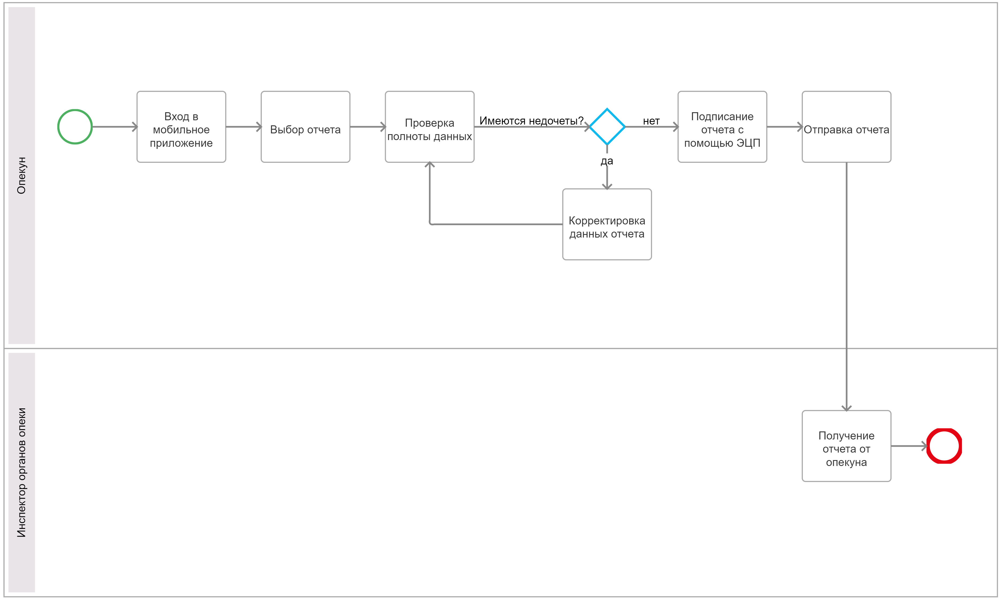

# 2.	ОПИСАНИЕ БИЗНЕС-ПРОЦЕССОВ

## 2.1.	Общая диаграмма процессов

## 2.2.	Бизнес-процесс "Подготовка отчета опекуном"
### 2.2.1. Диаграмма бизнес-процесса "Подготовка отчета опекуном"

## 2.2.2.	Описание процесса "Подготовка отчета опекуном"
Подготовка отчета опекуном за текущий период происходит путем создания отчета и загрузки расходных платежных документов, которые можно загружать в любое время, добавляя их к нужному отчету.

### 2.2.3.	Описание функций бизнес-процесса "Подготовка отчета опекуном"
*[В табличном виде дается описание каждой основной функции бизнес-процесса.
Формат описания приведен ниже.]*  

|Наименование функций|Роли пользователей|Входные данные|Описание действий|Выходные данные|
|----|----|----|----|----|
|Вход через Госуслуги|Опекун|Мобильное приложение|Опекун, если он является зарегистрированным на Госуслугах, вводит логин и пароль. В ином случае переходит по ссылке для регистрации новых пользователей|Доступ в ЛК опекуна|
|Регистрация на Госуслугах|Опекун|Страница для регистрации на Госуслугах новых пользователей|Опекун проходит все необходимые этапы регистрации на Госуслугах, в том числе подтверждение личности|Создан ЛК на Госуслугах|
|"Создание отчета"|Опекун|Появление нового отчета с присвоенным годом|Нажать на вкладку "Создание отчета" и указать номер года для отчета| Добавится строка во вкладке "Отчеты"|
|Заполнение данных по всем необходимым статьям|Опекун|Пустой отчет|Необходимо вручную внести все данные по предложенным полям. При отсутствии данных ставится прочерк|Строки заполнены|
|Загрузка документов|Опекун|Отчет|На странице для загрузки документов опекун выбирает из выпадающего списка нужным ему год, далее заполняет строки о наименовании статьи и сумме расхода|Данные внесены|
|Заполнение полей "Статья" и "Сумма"|Опекун|Отчет|В появившиеся строки опекун вносит данные|Наименование статей и сумма внесены|
|Добавление платежного документа|Опекун|Отчет|Загрузка платежного документа путем считывания QR-кода с чека или загрузки скан-документа|Загруженный документ прикреплен к отчету|
|Сохранение|Опекун|Отчет|Нажатие кнопки "Сохранение"|Отчет добавлен во вкладку "Отчеты"|

## 2.3.	Бизнес процесс "Отправка ежегодного отчета опекуном в органы опеки."
### 2.3.1. Диаграмма бизнес-процесса N  

### 2.3.2.	Описание процесса "Отправка ежегодного отчета опекуном в органы опеки".

Опекун авторизуется в приложении, выбирает в личном кабинете сформированный отчет по текущему периоду, производит подписание с помощью ЭЦП и нажимает кнопку "Отправить".

### 2.3.3.	Описание функций бизнес-процесса "Отправка ежегодного отчета опекуном в органы опеки"

|Наименование функций|Роли пользователей|Входные данные|Описание действий|Выходные данные|
|----|----|----|----|----|
|Вход в мобильное приложение|Опекун|Мобильное приложение|Опекун нажимает кнопку входа и вводит логин и пароль от ЛК Госуслуг|Опекун получил доступ к информации в ЛК|
|Выбор отчета|Опекун|ЛК опекуна|Опекун во вкладке "Отчеты" просматривает все имеющиеся ответы и нажимает на нужный|Отчет открыт|
|Проверка полноты данных|Опекун|Отчет|Опекун нажимает на кнопку "Просмотр" и имеет возможность увидеть всю внесенную информацию в данный отчет|Раскрытый отчет|
|Корректировка данных отчета|Опекун| Отчет|Опекун нажимает кнопку "Изменить" и отчет становится доступен для внесения корректировок|Отредактированный отчет|
|Подписание отчета с помощью ЭЦП|Опекун|Отчет|Опекун нажимает кнопку "Подписать", далее происходит выбор ЭЦП для подписи и сам процесс подписания|Отчет подписан|
|Отправка отчета|Опекун|Отчет|Опекун нажимает кнопку "Отправить"|Отчет доставлен в органы опеки. Статус отчета в приложении опекуна "Отправлен"|
|Получение отчета от опекуна|Инспектор органов опеки|Отчет|Отчет от опекуна попадает в базу инспектора|Инспектор получает возможность проверить отчет|

Таблица 3 – Описание функций процесса N  

## 2.4.	Бизнес процесс "Проверка поступившего отчета инспектором органов опеки".
### 2.4.1. Диаграмма бизнес-процесса  

### 2.4.2.	Описание процесса "Проверка поступившего отчета инспектором органов опеки".
Инспектор органов опеки выбирает отчет для проверки, осуществляет проверку всех вложенных документов, проставляет подходящий статус и заполняет графу "комментарий" при необходимости.

### 2.4.3.	Описание функций бизнес-процесса "Проверка поступившего отчета инспектором органов опеки".

|Наименование функций|Роли пользователей|Входные данные|Описание действий|Выходные данные|
|----|----|----|----|----|
|Вход в программу отчетности|Инспектор|Программа инспектора|Инспектор вводит логин и пароль для входа в личный кабинет. Если инспектор не зарегистрирован, то программа предлагает перейти по ссылке для регистрации|Получен доступ в программу|
|Выбор отчета для осуществления проверки|Инспектор|Личный кабинет|Из списка всех доступных отчетов инспектор выбирает отчет, используя выборку по статусу или иным способом|Открыт отчет для просмотра и обработки содержимого|
|Проверка отчета|Инспектор|Отчет|Инспектор открывает отчет и проверяет данные |Личные данные опекуна и опекаемого, данные по статьям имущества и доходов сверены|
|Проверка вложенных платежных документов|Инспектор|Отчет|Инспектор раскрывает приложенные документы по расходным статьям и производит сверку|Приложенные документы сверены|
|Выставление статуса|Инспектор|Отчет|Инспектор из выпадающего списка статусов выбирает подходящий статус и присваивает его отчету|Статус отчета изменен инспектором|
|Добавление комментария|Инспектор|Отчет|Инспектор в поле для комментария вводит необходимую информацию, которая необходима для исправления недочетов|Отчет содержит комментарий|
|Сохранение|Инспектор|Отчет|Инспектор нажимает кнопку "Сохранить", после чего данные о проверке отправляются в мобильное приложение опекуна|Поступление информации о результате проверки опекуну|
|Ознакомление с результатом проверки|Опекун|Отчет|Опекун получает уведомление об изменении статуса отчета, выбирает отчет из списка для просмотра. Также при наличии комментария опекун может просмотреть его во вкладке для уведомлений|Опекун опопвещен о результатах проверки отчета|

