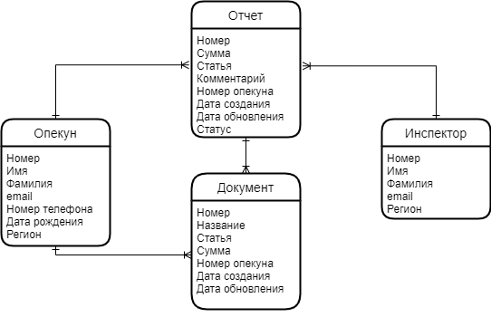
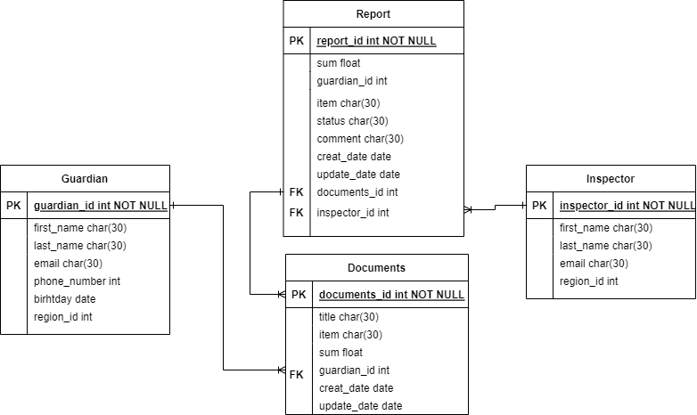
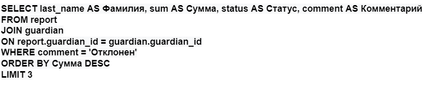

# 3. ОПИСАНИЕ СУЩНОСТЕЙ СИСТЕМЫ

## 3.1.	Сущности предметной области
### 3.1.1.	Логическая схема предметной области  

  
Рисунок 1 – Логическая схема предметной области

Таблица 1 – Описание атрибутов сущности предметной области
| № п/п | Атрибут | Обязательность | Тип данных |
|----|----|----|----|
| 1 | Номер | Уникальный | число |
| 2 | Имя | Уникальный | строка |
| 3 | Фамилия | Уникальный | строка |
| 4 | email | Уникальный | строка |
| 5 | Номер телефона | Обязательный | число |
| 6 | Дата рождения | Обязательный | дата |
| 7 | Регион | Уникальный | строка |
| 8 | Сумма | Уникальный | число |
| 9 | Дата создания | Уникальный | дата |
| 10 | Дата обновления | Уникальный | дата |
| 11 | Статус | Уникальный | строка |
| 12 | Название | Обязательный | строка |
| 13 | Статья | Обязательный | строка |
| 14 | Комментарий | Обязательный | строка |

### 3.1.2.	Физическая модель данных предметной области 

  
Рисунок 2 – Физическая модель данных предметной области

Таблица 2 – Описание атрибутов таблицы БД предметной области 
| № п/п | Атрибут | Наименование в БД | Обязательность | Тип данных в БД и длина |
|----|----|----|----|----|
| 1 | Номер опекуна | guardian_id | Уникальный | int(8) |
| 2 | Имя | first_name | Уникальный | char(30) |
| 3 | Фамилия | last_name | Уникальный | char(30) |
| 4 | Эл. почта | email | Уникальный | char(30) |
| 5 | Номер телефона | phone_nunber | Обязательный | int(11) |
| 6 | Дата рождения | birthday | Обязательный | date(10) || 7 | Номер региона | region_id | Уникальный | int(3) |
| 8 | Сумма | sum | Уникальный | float |
| 9 | Дата создания | creat_date | Уникальный | date(10) |
| 10 | Дата обновления | update_date | Уникальный | date(10) |
| 11 | Номер документа | documents_id | Уникальный | int(8) |
| 12 | Название | title | Обязательный | char(30) |
| 13 | Статья | item | Обязательный | int |
| 14 | Статус | status | Уникальный | char(30) |
| 15 | Номер инспектора | inspector_id | Уникальный | int(7) |
| 16 | Комментарий | comment | Обязательный | char(30) |

### 3.1.3.	SQL-запрос для предметной области

 

| Фамилия | Сумма | Статус | Комментарий |
|----|----|----|----|
| Абрамов | 78000 | Отклонен | Не читаем чек |
| Бутаков | 45320 | Отклонен | Повторное обращение |
| Титова | 39800 | Отклонен | Отсутствует чек |

